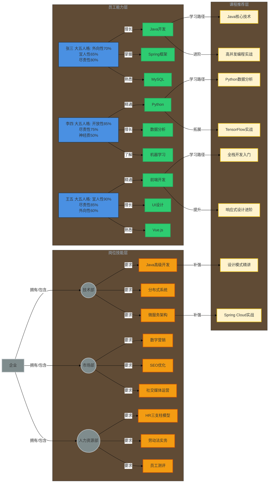
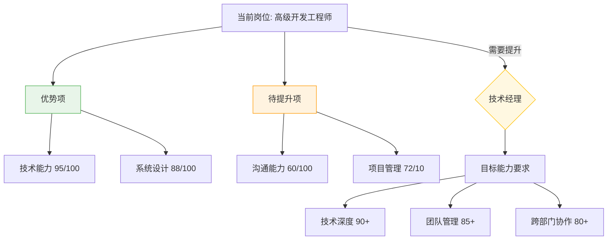

```mermaid
heatMap
    title 企业人力资源能力热力图 - 能力短板识别
    row ["部门/职能", "战略规划", "技术研发", "运营执行", "市场营销", "人力资源", "财务管理"]
    col ["能力维度", "专业深度", "团队协作", "创新力", "决策效率", "数字化水平", "人才储备"]
    
    
cell [
    [null, "一般", "优秀", "一般", "薄弱", "一般", "薄弱"],
    ["一般", "优秀", "良好", "薄弱", "一般", "薄弱", "优秀"],
    ["薄弱", "良好", "优秀", "一般", "薄弱", "优秀", "一般"],
    ["优秀", "薄弱", "一般", "优秀", "良好", "薄弱", "良好"],
    ["良好", "优秀", "薄弱", "优秀", "一般", "一般", "优秀"],
    ["薄弱", "一般", "优秀", "薄弱", "优秀", "良好", "一般"]
]

color
    薄弱: #FF6B6B
    一般: #FFD93D
    良好: #B6D7A8
    优秀: #4ECDC4
```