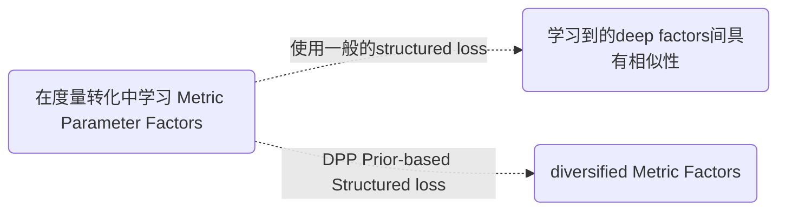

# Abstract

IEEE Transactions on Geoscience and Remote Sensing, 2019, 57(6): 3599-3618.	

## Index

MS-CNN → multi-scale feature

determinantal point process (DPP) 

deep metric learning(DML)

## Reference

[结构化损失的理解(Structural Risk)](jianshu.com/p/228606144383) 

[DPP在文本摘要中的应用:  << Improving the Similarity Measure of Determinantal Point Processes for Extractive Multi-Document Summarization>>](https://arxiv.org/abs/1906.00072v1)

## 提出原因

训练样本数量有限，特别是对于具有**较大类内方差和低类间方差**的图像，学习的深度模型通常不是最优的。

## 创新点

* 提出了一种具有**多尺度卷积**和**使用DPP方法来促进多样性的深度度量**的新型CNN（**DPP-DML-MS-CNN**），该模型同时利用了多尺度特征和多样化的深度度量，用于高光谱图像分类。
  

> 为了加速模型的训练过程，首先通过**预训练**来学习MS-CNN的参数，
>
> 然后采用**微调**的方法用 **基于DPP的结构损失**来**微调**训练深度模型 ,联合学习 MS-CNN的参数W 和度量因子B。
>
> 最后，将学习到的 **度量因子B** 也加入到 **深度模型中** 用于从高光谱图像中提取判别特征。

# MS-CNN

在本文中，提出了具有多尺度卷积（MS-CNN）的新型卷积神经网络，通过将多尺度滤波器组合并到CNN中, 从高光谱图像中**提取深层多尺度特征**。

设计了如下三种类型的MS-CNN结构:

> Notice:
>
> 分别为1D MS-CNN, 2D MS-CNN, 3D MS-CNN
>
> 1D: 通过把多尺度卷积的结构合并到1D-CNN里形成的, 然后使每一个尺度的卷积结果有**相同通道**数, 最后**concat**到一起
>
> 2D: 由于空间结构的破坏, 仍然不能很好利用**邻域特征**,降低模型表示能力  
>
> 3D: **1*1，3\*3 多尺度滤波器组提取多尺度特征**
>
> 1D - 3D: 也可以看出度量转换(metric transformation) 在本文被实现为全连接层

# **Deep metric learning** (DML)

**度量**

好的度量可以有助于找到更好的特征, 构建更好的模型. 度量分为显式度量和隐式度量. 

1. 显式度量: 如常用的欧氏距离、马氏距离、余弦相似度等, 不需要学习即可计算出来
2. 隐式度量: 在特定任务中, 单纯的用这些简单距离公式达不到预期效果时, 需要**对隐式的距离进行学习**, 即所谓的度量学习.

**度量学习的目标**

学习一个度量相似度的距离函数:  使相似的目标距离近, 不相似的目标距离远.

**度量学习的发展**

也和机器学习的发展情况大概一致，从最初的基于传统方法，逐渐过渡到如今的基于深度神经网络。度量学习在计算机视觉、视频分析、文本挖掘、生物信息学等多个领域均有着广泛的应用。可以说，在机器学习中，没有度量，就没有好的模型。凡是需要用到机器学习的地方，都需要度量。

**基于深度学习**的度量学习其发展主要体现在**不同的Loss Function上**, 最基本的2种: Triplet-lose,Contrastive Loss.

**基本思路**

给定训练样本, **样本中包含预先观测到的一些对于样本的知识(先验), 如哪两个样本距离更近, 哪两个更远. 学习算法以先验为约束并构建目标函数, 学习这些样本间的一个很好的度量, 并满足预先给定的限制条件. 从这种意义上看也可以看做为一种特定条件下的优化问题.** 

> 度量学习在人脸识别等应用上, 此方法已经取得了很好的效果

### **缺点**

但是，在**度量转换**中用一般的结构损失来学习度量参数因子通常会使学习到的因子之间具有**相似性**。这种相似性将负面影响深度度量模型对高光谱图像的表示能力。

1. HSI 没有足够标记的样本
2. 不同类别样本表现相似特征

**因此学习到的用于表示HSI的metric factors明显冗余,不同metric factors从图像提取相似特征, 导致分类性能降低**

### 解决方法

需要加入正则化方法

1. 施加促进多样性的先验, 如 DPP先验

# Diversity-Promoting Learning

本文将会使用**结构化损失的深度度量学习方法**来**联合**训练前面提出的分类模型.

但是在度量变换中，一般的结构化损失使得学习到的度量参数因子之间存在**相似性**, 会负面影响**深度度量模型的表示能力**.

为了使学习到的**度量参数因子多样化**，并进一步提高深度度量的表示能力，提出了一种**基于DPP的结构化损失**, 对学习到的度量参数因子施加**确定性点过程（DPP）先验**，以**鼓励学习到的度量因子相互排斥**。

在本文中，使用这种**具有特殊结构损失的深度度量学习方法**，以**联合训练**所提出的模型。

## A. Structured Loss for MS-CNNs

**结构损失L用于最小化所有正对之间的距离,并惩罚了相应的负对**

特征距离函数:

负对惩罚函数:

> 其中, m是一个正值，表示对负对距离的惩罚边界。
> xi, xj: 同一类别的样本对(positive pairs) xi, xk：不同类别样本对(negative pairs)
> 可以注意到，**B可以看成是线性映射，可以训练成MS-CNN中的全连接层。**

### **缺点**

但是，由于HSI图像具有以下特点:

1. HSI 没有足够标记的样本
2. 不同类别样本表现相似特征

> 可以理解为, 假如只有2 个相同的样本, 则Metric factors 只能从这两个样本中提取很少且相同的特征, 无法建立一个有效的分类模型.

因此在**度量转换**中用**这种一般的结构损失**来学习度量参数因子通常会使学习到的因子之间具有**相似性**。如图所示，使不同metric factors**集中提取HSI相似特征**上, 这会导致深度度量因子明显冗余, 导致分类性能降低

> 可以理解为,不同的因子提取不同的特征, 当feature类似或者比较少时, 能提取更加special的特征

>如左图，没有DPP的情况下, 带有紫色标记的功能将被忽略.
>
>**如右图, 即使训练样本有限**，也可以通过将DPP先验**强加于学习因素上来使学习模型多样化**，并且不同因素着重于对独特特征进行建模。最终，所有**因素都可以从图像中模拟很大比例的特征**，从而提高了分类性能

### **解决**

为了鼓励这些因素多样化并进一步提高分类性能，引入了正则化方法。该正则化方法旨在**将辅助信息添加到参数估计中**。因此，它可以鼓励学习的因素满足**特定的属性**。即, **general → special**

所以提出了一种**基于DPP的结构损失**, 对学习到的度量参数因子施加确定性点过程（DPP）先验，以**鼓励学习到的度量因子相互排斥**。在本文中，使用这种**具有特殊结构损失的深度度量学习方法**，以**联合训练**所提出的模型。

## B. Determinantal Point Process Priors

通过**定义**学习因子之间的**成对相似性**（通常是基于核函数），DPP先验会根据核矩阵的**行列式**将**较高的概率**分配给一组**不同的因子**。同样，DPP先验倾向于**多样的factors**.

>  θ在此处是连续空间, B是θ的任意子集
>
>  𝑝(B⊂θ) 表示B中元素采样中**被命中的概率**, 即B的DPP先验
>
>  >**先验概率**是指根据**以往经验和分析得到的概率**，如全概率公式
>  >
>  >**后验概率**的计算要以先验概率为基础。事情已经发生,要求这件事情发生的原因是由某个因素引起的可能性的大小. 后验概率可以根据通过贝叶斯公式，用先验概率和似然函数计算出来。
>
>  λ可以视为**权衡参数**，该参数衡量多样化惩罚的权重。

矩阵K 被称作 DPP kernel，是一个 𝑁×𝑁的实对称方阵。

>  K~B~是根据B中的元素从 𝐾中按行按列索引得到的方阵，也即K~B~是 𝐾的主子式
>
>  > 主子式:在n 阶行列式中，选取行号（如 1、3、7行），再选取与行号相同的列号（1、3、7 列），则行数和列数都为i个的行列式即为n阶行列式的i阶主子式
>
>  det(K~B~) 是矩阵K~B~的行列式值。
>
>  **𝐾 的元素 𝐾𝑖𝑗 可以看做集合θ中第𝑖,𝑗个元素之间的相似度**
>
>  𝐾𝑖𝑖 越大的样本，被采样出来的概率越大
>
>  𝐾𝑖𝑗越大的的两个样本 {𝑖,𝑗} 越相似，
>
>  被同时采样出来的概率越低

**原理**

**ML中子集选择的目标**是从Ground set中选择**高质量但多样化**的items子集, 这种高质量和多样性的平衡在ML中通常使用DPP来保持, 其中DPP赋予子集上的分布使**选择两个相似项的概率是反相关**的.

DPP就是一个抽样方法: 两个元素作为子集被**抽取的概率**不仅和单一元素被抽取的概率相关,还和这两个元素的相关性有关。**单一元素被选择的概率越大，同时元素之间的相似度越低($Kii, Kjj$大,$Kij$小), 这个集合被选择的概率越高**

存在一个行列式可以刻画任意子集被选中的概率, 这个行列式的若干行列主子式正好对应子集被选中概率, 那么这个过程叫**行列式过程**

**应用**

1. 推荐系统多样性提升的算法

   > 0.The_Use_MMR_Diversity_Based_LTMIR
   >
   > mmr算法 （diversity由整体的相似度的负数构造, max取值也是greedy思想）
   >
   > 1.k-DPPs: Fixed-Size Determinantal Point Processes
   >
   > 限定子集元素个数为K
   >
   > 2.Fast Greedy MAP Inference for Determinantal Point Process to Improve Recommendation Diversity
   >
   > 如何构造半正定矩阵L， fi隐向量不需要构造

2. 规范GAN的generator, 使生成数据更加diverse, 缓解mode collapse

3. 如果已知一个过程是DPP过程, 则可知其行列式, 可对其进行分布更均匀的采样

**例子**

i, j子集被选中概率计算:																					

> i,j的相关性越大时, det(K(βi, βj))越小, i,j同时选择的概率p({i,j})就越小

二维平面随机采样:

**Q: 不同的因子就可以diverse??(高亮表示存疑)**

A: 将两个类似特征强制分配给两个选择到的不同的factors, 此时每个Factor可代表一个feature

==Q: factors 是什么形式的?==

Q: DPP如何实现的

A: ①核矩阵K 可以表示相关性 ②选取相关性低的factors来对HSI的features进行表示

## C. DPP-Based Structured Loss for MS-CNNs

通过**多样化（diversification）**，不同的因子(factors)倾向于对不同的特征(features)做出反应, 可以根据图像建模更多的特征(features)。因此需要加入促进多样性的先验(diversity-promoting priors)。

为了使学习到的**度量参数因子多样化**，并进一步提高深度度量的表示能力，提出了一种**基于DPP的结构损失**, 对学习到的度量参数因子施加确定性点过程（DPP）先验，以**鼓励学习到的度量因子相互排斥**。在本文中，使用这种**具有特殊结构损失的深度度量学习方法**，以**联合训练**所提出的模型。

度量参数因子B可以通过最大后验概率(MAP)估计：

>  其中X是训练样本的集合。
>
>  **DPP prior**体现在 p(B|X) 上, 为已知选中的训练样本X以后选中B的概率

等效对数似然方程可表示为:

转化为约束优化:

通过通过拉格朗日乘数，重新化为无约束优化:

用于训练MS-CNN的**基于DPP的结构损失** :

## D. Optimization

通过随机梯度下降方法联合训练MS-CNN和深度度量。训练过程可以看作是最小化基于DPP的结构损失。W表示MS-CNN中的参数, B表示度量参数因子。可以通过以下方式估算所提出模型中的参数

基于DPP的结构化损失L相对于度量因子B的梯度可以计算为: 

# Summary

该模型通过确定性点过程（DPP）先验而非独立先验来使深度度量多样化, 开发了一种具有**多尺度卷积和多样化度量的CNN**，以获得高光谱图像分类的判别特征。

基于DPP的结构化损失的学习模型用于从高光谱图像中提取特征**微调**模型**，**然后使用Softmax分类器用于分类**。**

==Q: features和Metric什么时候进行转换的==

A: 在MS-CNN中, 最后一层被训练为全连接层的Metric Transformation便是由features→Metric factors, 之后使用基于DPP先验的结构损失进行微调, ==**鼓励Metric factors相互排斥**==, 使模型具有更好的表示能力.

Q: Metric transformation和fully connection什么区别?

Q: 参数W 和参数B , W前后都有吗, B是什么形式?

A: W是MS-CNN中的参数, B是度量参数因子. 都通过**随机梯度下降法**进行更新

# Result

## A.Computational Performance

> For pre-training procedure:
>
>  the training epoch, the base learning rate, the weight decay, and the momentum value 
>
> were set to 20000, 0.0001, 5e-5, and 0.9, respectively.
>
> For fine-tuning procedure: 
>
> the training epoch, the base learning rate, the weight decay, and the momentum value 
>
> were set to 1000, 1e-5, 5e-5, and 0.9, respectively.

> 3-D频谱空间分类通常需要较少的时间。原因是3-D分类中的参数少于1-D和2-D分类中的**参数**

## B. Model’s Diversity

> 模型的**多样性**随着权衡参数λ的增加而增加。原因是，较大的λ值导致度量参数因数的权重较高，从而导致度量参数因数相互排斥。
>
> 可以明显看出，该方法的多样性比λ设置为0时大。换句话说，**基于DPP的方法所学习的模型可以增加原始模型多样性。**

## C. Effects of Diversity Weight λ

> 
>
> 从四个数据集的趋势可以看出，λ值越大，分类精度越高，而λ值过大会导致性能下降。
>
> 在实际应用中，采用交叉验证技术来选择合适的λ来满足不同任务的特殊要求。
>
> **λ****是权衡参数**，它说明了模型的优化和多样性之间的权衡。但是，太大的λ将过多的注意力集中在模型的**多样性**上，而忽略了**优化项**，从而导致分类性能**下降**。

## D. Effects of Neighbor Size  

>在Pavia University和Indian Pines数据上，分类性能达到**5×5**邻居大小时几乎达到了最佳性能。 
> 在Salinas和KSC数据上，分类性能以**9×9**的邻居大小排名最高。原因是Salinas和KSC数据在不同类别之间具有明显的边界，因此，较大的核可以利用更多有用的空间信息，并获得更好的性能。

## E. Classification Results and Classification Maps

